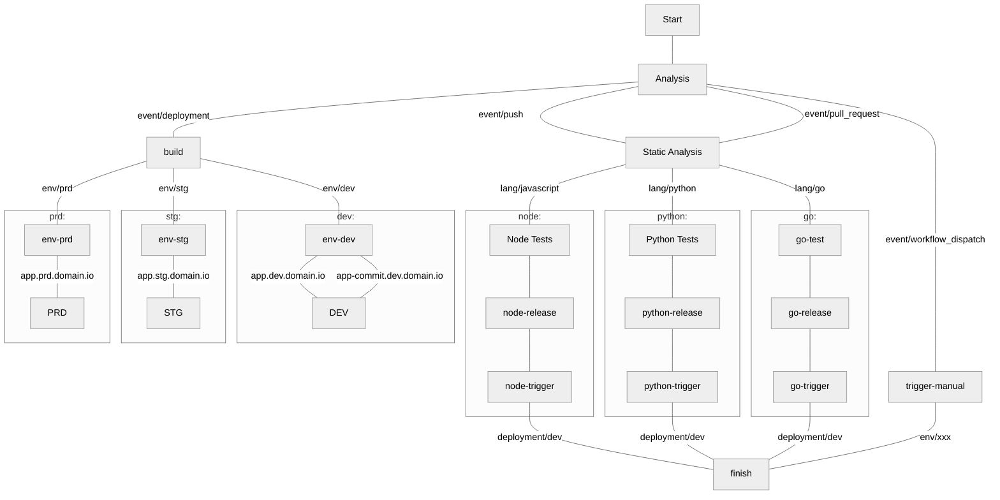
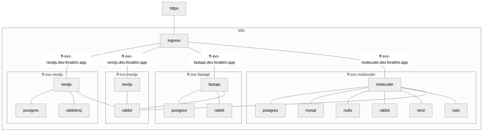
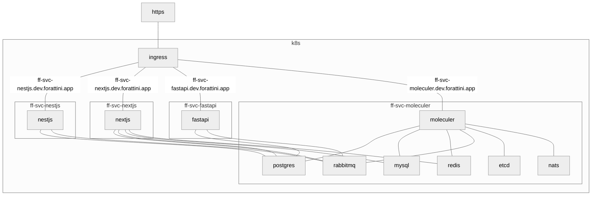

# Github Actions Fast Pipelines

[](https://github.com/semantic-release/semantic-release)

This is a personal work in progress. Keep in mind your suggestions are welcome! :)

These workflows are highly opinionated **kubectl-apply** or **helm-upgrade** pipelines.

       

## tldr;

1. Config tour repository with [these](#repository-secrets) secrets.
1. Create a directory `.github/workflow` in your repository and add [this](#pipeline) file.
1. Create a another directory `manifests` and add [this]() file.
1. Commit and open your repository actions page! :)

---

##### Table of contents

1. <a href="#introduction">Introduction</a>
   1. <a href="#features">Features</a>
   1. <a href="#motivation">Motivation</a>
   1. <a href="#repository-patterns">Repository Patterns</a>
   1. <a href="#repository-examples">Repository Examples</a>
   1. <a href="#environments">Environments</a>
   1. <a href="#introduction">Repository Structure</a>
   1. <a href="#introduction">Repository Secrets</a>
1. <a href="#pipelines">Pipelines</a>
   1. <a href="#flow">Flow</a>
   1. <a href="#starting">Starting</a>
   1. <a href="#static-web-application">Static Web Application (app)</a>
   1. <a href="#mobile-application">Mobile Application (mob)</a>
   1. <a href="#service">Service (svc)</a>
   1. <a href="#infrastructure-as-code">Infrastructure as Code (iac)</a>
   1. <a href="#package">Package (pkg)</a>

---

## Introduction

### Motivation

We, as solutions builders, spend **hours** of precious time trying to build and deploy a solution. As the complexity of your solution rises, the challenges of it's versioning and dependencies management follows.

**What can we do about this time invested in DevOps?**
Standardize solutions' deliverables to standardize their build. With that in mind we will define a few patterns to enhance developer experiences towards build & deployment cycles.

**I've finished the staging environment, now have to plan the production env.**
No, every environment _should_ be equivalent and work better with autoscaling.

### Repository Patterns

This pipeline assumes you have just `5` types of repositories:

|                   Name | Short | Description                                        |          Result          |
| ---------------------: | :---: | -------------------------------------------------- | :----------------------: |
|        Web Application |  app  | Front-end application with internet-facing ingress | language-based container |
|     Mobile Application |  mob  | Mobile application                                 |         apk, aab         |
|                Service |  svc  | Microservice that may - or may not - have ingress  |  nginx-based container   |
| Infrastructure as Code |  iac  | Code that generates cloud infrastructure           |            -             |
|                Package |  pkg  | Embedded code artifact                             | language-based artifacts |

Those repositories _must_ obey a name pattern:

`{ecosystem}`-`{type}`-`{name/client/integration}`

Examples:

- `ff-svc-clients`: microservice that manages clients' data
- `ff-app-budget`: application that organizes the company finances
- `ff-mob-auth`: 2FA mobile application
- `ff-iac-aws`: infra as code to manage the aws environment
- `ff-pkg-csv`: csv handler package

### Repository Examples

Checkout the few repositories that implement this repository logic:

| Type | Solution                                                                                                                                                                                                                                                                                                                                                                                                                                             |                                          Repository                                           |                                               Pipeline                                               |                                                                     Deploy                                                                      |
| :--: | ---------------------------------------------------------------------------------------------------------------------------------------------------------------------------------------------------------------------------------------------------------------------------------------------------------------------------------------------------------------------------------------------------------------------------------------------------- | :-------------------------------------------------------------------------------------------: | :--------------------------------------------------------------------------------------------------: | :---------------------------------------------------------------------------------------------------------------------------------------------: |
| app  |                                                                                                                |        [filipeforattini/ff-app-react](https://github.com/filipeforattini/ff-app-react)        |         |     [](https://ff-app-react.dev.forattini.app)      |
| app  |                                                                                                             |          [filipeforattini/ff-app-vue](https://github.com/filipeforattini/ff-app-vue)          |           |       [](https://ff-app-vue.dev.forattini.app)        |
| mob  |     | [filipeforattini/ff-mob-react-native](https://github.com/filipeforattini/ff-mob-react-native) |  | [](https://ff-svc-express.dev.forattini.app) |
| svc  |                                                                                                          |      [filipeforattini/ff-svc-express](https://github.com/filipeforattini/ff-svc-express)      |       |   [](https://ff-svc-express.dev.forattini.app)    |
| svc  |                                                                                                                                                                                                                             |      [filipeforattini/ff-svc-fastapi](https://github.com/filipeforattini/ff-svc-fastapi)      |       |   [](https://ff-svc-fastapi.dev.forattini.app)    |
| svc  |                                                                                                                                                                                                                               |        [filipeforattini/ff-svc-flask](https://github.com/filipeforattini/ff-svc-flask)        |         |     [](https://ff-svc-flask.dev.forattini.app)      |
| svc  |                                                                                                        |    [filipeforattini/ff-svc-moleculer](https://github.com/filipeforattini/ff-svc-moleculer)    |     | [](https://ff-svc-moleculer.dev.forattini.app)  |
| svc  |                                                                                                           |       [filipeforattini/ff-svc-nestjs](https://github.com/filipeforattini/ff-svc-nestjs)       |        |    [](https://ff-svc-nestjs.dev.forattini.app)     |
| svc  |                                                                                                        |       [filipeforattini/ff-svc-nextjs](https://github.com/filipeforattini/ff-svc-nextjs)       |        |    [](https://ff-svc-nextjs.dev.forattini.app)     |

### Environments

Every application _should_ have 5 environments:

|              Name | Short | Description                                   |
| ----------------: | :---: | --------------------------------------------- |
|       Development |  dev  | Env for you and your team to test and explore |
|           Staging |  stg  | Stable env for code shipping                  |
|           Sandbox |  sbx  | Production-like env for external developers   |
|        Production |  prd  | Where the magic happens                       |
| Disaster Recovery |  dry  | Production copy                               |

#### Development (dev)

_Should_ be sync'ed with your latest code.

Here is where the magic happens:

- Databases are born e die daily.
- Here is where your crazy ideas and prototypes appears.

In this environment, every service _should_ probably connect to every dependencies' sandbox environments.

This environment _should_ be inside your company's inner VPN.

#### Staging (stg)

_Should_ be your internal sharing environment for testing and QA'ing.

Here you test the versioning, should be sync'ed with your **tags**.

Here you will simulate every production upgrade.

In this environment, every service _should_ probably connect to every dependencies' sandbox environments.

This environment _should_ be inside your company's inner VPN.

#### Sandbox (sbx)

_Should_ be your production-like environment for external partners testers and a few flags or mocks should guarantee no finantial consequences.

In this environment, every service _should_ probably connect to every dependencies' sandbox environments.

This environment _should_ be public and using the same version.

#### Production (prd)

The environment that your clients will access.

_Should_ be similar to your staging environment.

#### Disaster Recovery (dry)

The environment that will replace your production environment when it goes offline.

_Should_ be identical to your production environment.

_May_ have a few features disabled.

---

### Repository Structure

Your repositor's structure should follow a few

| directory  | description                           |
| ---------- | ------------------------------------- |
| /.github   | Collection of Github artifacts        |
| /manifests | Your solutions' artifacts for deploys |
| /src       | Your code                             |

Example:

```txt
├─ .github
│  └─ workflows
│  │  └─ pipeline.yml
│  └─ dependabot.yml
├─ manifests
│  ├─ configs
│  │  └─ dev.env
│  ├─ dependencies
│  │  └─ dev.yml
│  ├─ secrets
│  │  └─ dev.gpg
│  ├─ k8s.yml
│  └─ helm.yml
├─ build
│  // distibuition version of our code
└─ src
   // our code goes here
```

### Repository Secrets

|                  Name | Description                                |
| --------------------: | ------------------------------------------ |
|        GPG_PASSPHRASE |                                            |
|           KUBE_CONFIG | Your `~/.kube/config` file as base64.      |
| PIPELINE_DEPLOY_TOKEN | A GitHub token, see the permissions below. |
|     REGISTRY_USERNAME | Registry username.                         |
|     REGISTRY_PASSWORD | Registry password.                         |

### Pipelines

**Before start: fork it!** You downt want to have your pipeline broken by someone's commit ant let your customers in the dark in case something happens.

This pipeline was designed to make every single build predictable and enhance developers experience with a few set of features.

### Features

Versioning with [Semantic-Release](https://semantic-release.gitbook.io/semantic-release/)

Linter:

- [Hadolint](https://github.com/marketplace/actions/hadolint-action) for Dockerfiles
- ESLint for Javascript
- PyLint for Python

Static analysis:

- [GitLeaks](https://github.com/zricethezav/gitleaks) for repository
- [Trivy](https://github.com/aquasecurity/trivy) for repository and image
- Open Source Static Analysis Runner
- GitHub's CodeQL analyzer
- Dynamic container generator

### Flow

This is a birs' view of the whole pipeline.



**Insights:**

- Every `push` (commits with new code) _should_ be done in other branches, git-flow style.
- Every `push` _should_ deploy a _commit version_ into `dev`
- Every `pull-request` or `push` into develop or main/master _should_ semantic version automatically and generate a `tag`
- Every `tag` should deploy a new version to `stg`
- Deploys to `prd` should be done manually while the project grows maturity

### Starting

Choose what pipeline your project will use by adding into your repository the file `.github/workflows/pipeline.yml`.

Suggestion for single environment systems:

```yml
name: pipeline

on:
  push:
  deployment:
  release:
    types: [created]
  pull_request:
    types: [opened, reopened]

jobs:
  SVC:
    uses: filipeforattini/ff-iac-github-actions/.github/workflows/svc.yml@main
    secrets: inherit
    with:
      mainBranch: main
      containerRegistry: ghcr.io
      environmentsAsNamespaces: true
```

Suggestion for multi environment systems:

```yml
name: pipeline

on:
  push:
  deployment:
  release:
    types: [created]
  pull_request:
    types: [opened, reopened]

  workflow_dispatch:
    inputs:
      environment:
        description: "Environment"
        required: true
        type: choice
        default: "dev"
        options:
          - dev
          - stg
          - prd

jobs:
  SVC:
    uses: filipeforattini/ff-iac-github-actions/.github/workflows/svc.yml@main
    secrets: inherit
    with:
      mainBranch: main
      containerRegistry: ghcr.io
```

### Static Web Application

Example of `pipeline.yml`:

```yml
name: pipeline

on:
  push:
  deployment:
  release:
    types: [created]
  pull_request:
    types: [opened, reopened]

  workflow_dispatch:
    inputs:
      environment:
        description: "Environment"
        required: true
        type: choice
        default: "dev"
        options:
          - dev
          - stg
          - prd

jobs:
  SVC:
    uses: filipeforattini/ff-iac-github-actions/.github/workflows/app.yml@main
    secrets: inherit
    with:
      mainBranch: main
      containerRegistry: ghcr.io
      environmentsAsNamespaces: true
```

### Service

Example of `pipeline.yml`:

```yml
name: pipeline

on:
  push:
  deployment:
  release:
    types: [created]
  pull_request:
    types: [opened, reopened]

  workflow_dispatch:
    inputs:
      environment:
        description: "Environment"
        required: true
        type: choice
        default: "dev"
        options:
          - dev
          - stg
          - prd

jobs:
  SVC:
    uses: filipeforattini/ff-iac-github-actions/.github/workflows/svc.yml@main
    secrets: inherit
    with:
      mainBranch: main
      containerRegistry: ghcr.io
      environmentsAsNamespaces: true
```

#### Parameters

| Name                     | Required | Default                                                                               | Description                                          |
| ------------------------ | -------- | ------------------------------------------------------------------------------------- | ---------------------------------------------------- |
| mainBranch               | false    | master                                                                                | Main repository branch may interfere with versioning |
| ecosystem                | false    | -                                                                                     | Special prefix that will be added to the image name  |
| containerRegistry        | false    | ghcr.io                                                                               | Container registry to upload container images        |
| environmentsASnamespaces | false    | false                                                                                 | Separate environments as namespaces                  |
| staticAnalysis           | false    | false                                                                                 | Enable static analysis scans                         |
| autoVersioning           | false    | true                                                                                  | Enable auto versioning with semantic versioning      |
| nodeMatrix               | false    | '[16, 17, 18]'                                                                        | Node's testing matrix                                |
| nodeVersion              | false    | '18'                                                                                  | Node's container default version                     |
| pythonMatrix             | false    | '["3.8", "3.9", "3.10"]'                                                              | Python's testing matrix                              |
| pythonVersion            | false    | '3.10'                                                                                | Python's container default version                   |
| goMatrix                 | false    | '["1.18"]'                                                                            | Go's testing matrix                                  |
| goVersion                | false    | '1.18'                                                                                | Go's container default version                       |
| platforms                | false    | linux/386,linux/amd64,linux/arm/v7,linux/arm/v8,linux/arm64,linux/ppc64le,linux/s390x | Multi-plataform container builds                     |

#### Deploy with kubetl apply

Create a file `k8s.yml` in your `manifests` directory.

```yml
#@data/values
---
port: 1234

env:
  - name: TZ
    value: America/Sao_Paulo

ingress:
  enable: true
  className: traefik

  tls:
    enable: true
    domain: your.domain
```

#### `MOB` pipeline

##### Requirements

###### Android

Follow the [Android Developer Guide](https://developer.android.com/studio/publish/app-signing) for more insights.

Generate your key:

```bash
keytool -genkey -v \
  -keystore $HOME/.android/ff-pipeline.jks \
  -alias pipeline-key \
  -keyalg RSA \
  -keysize 2048 \
  -validity 10000
```

Export your key with `keytool` from Android's:

```bash
keytool -export \
  -rfc \
  -keystore $HOME/.android/ff-pipeline.jks \
  -alias pipeline-key \
  -file pipeline-key.pem
```

Add the variable `ANDROID_KEYSTORE_PASSWORD` with the password used:
Add the variable `ANDROID_KEYSTORE_CERT` with the value of `pipeline-key.pem`:

```bash
# cat pipeline-key.pem
-----BEGIN CERTIFICATE-----
...
-----END CERTIFICATE-----
```

Add to your `build.gradle` config:

```groovy
android {
  signingConfigs {
    config {
      storeFile file(System.getenv("ANDROID_KEYSTORE_PATH"))
      storePassword System.getenv("ANDROID_KEYSTORE_PASSWORD")
      keyAlias "pipeline-key"
      keyPassword System.getenv("ANDROID_KEYSTORE_PASSWORD")
    }
  }
}
```

### Requirements

Configure your k8s cluster and get your `~/.kube/config`.

## Daily work

### Commits & Versioning

```bash
git commit -m "action(scope): subject"
```

Where the actions:

- `feat`: new feature for the user, not a new feature for the build script
- `fix`: bug fix for the user, not a fix for a build script
- `docs`: documentation changes
- `style`: formatting, lack of semicolons, etc; no changes to the production code
- `refactor`: refactoring the production code, for example. renaming a variable
- `test`: adding missing tests, refactoring tests; no changes to the production code
- `chore`:updating grunted tasks, etc; no changes to the production code

Adds `BREAKING CHANGE` in the commit message and it will generate a new **major** version.

### Secrets

```bash
gpg -v \
  --symmetric \
  --cipher-algo AES256 \
  --output ./manifests/secrets/dev.gpg \
  ./manifests/secrets/dev.env
```

Thanks to:

- https://evilmartians.com/chronicles/build-images-on-github-actions-with-docker-layer-caching
- https://github.blog/2022-05-09-supercharging-github-actions-with-job-summaries/
- https://blog.gitguardian.com/github-actions-security-cheat-sheet/

## Example ecosystem

This ecosystem generates few data per second as samples for our apis.

### Architecture

#### Full independent

In this implementation, each service has its own resources.



#### Shared resources

In this implementation, all services connects to a shared resource.


