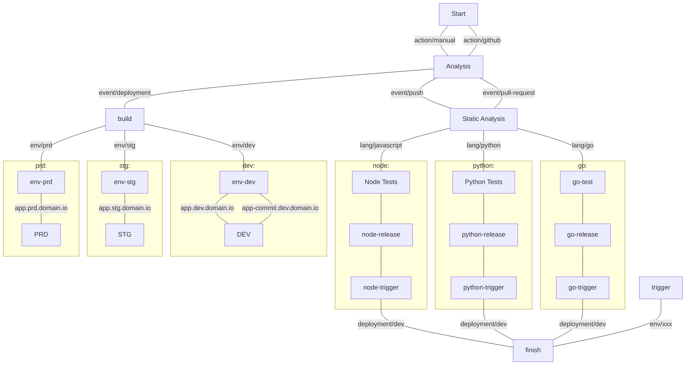
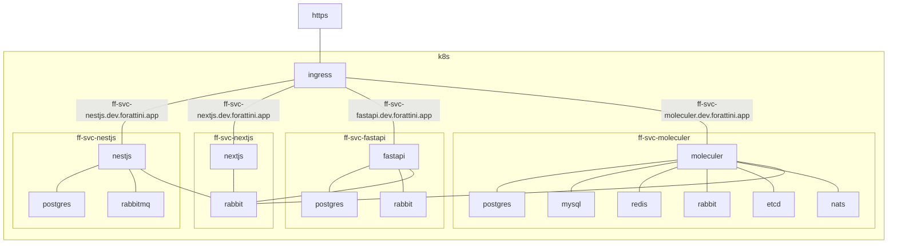
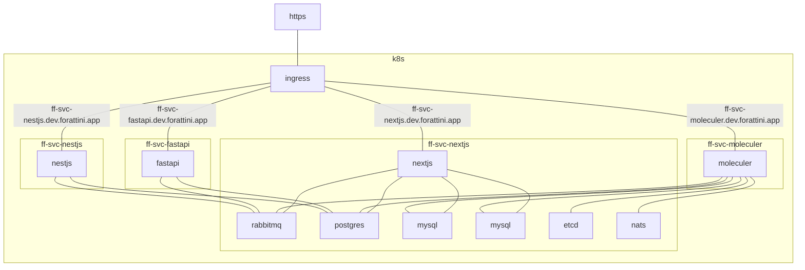

# Github Actions Fast Pipelines

[](https://github.com/semantic-release/semantic-release)

This is a personal work in progress. Keep in mind your suggestions are welcome! :)

These workflows are highly opinionated **kubectl-apply** or **helm-upgrade** pipelines.

       

## Introduction

### Features

- Versioning with [Semantic-Release](https://semantic-release.gitbook.io/semantic-release/)
- Linter:
    - [Hadolint](https://github.com/marketplace/actions/hadolint-action) for Dockerfiles
    - ESLint for Javascript
    - PyLint for Python
- Static analysis: 
    - [GitLeaks](https://github.com/zricethezav/gitleaks) for repository
    - [Trivy](https://github.com/aquasecurity/trivy) for repository and image
    - Open Source Static Analysis Runner

### Repository Patterns

This pipeline assumes you have just `4` types of repositories:

| Name | Short | Description | Result |
| ---: | :---: | --- | :---: |
| Web Application | app | Front-end application with internet-facing ingress | language-based pod |
| Mobile Application | mob | Mobile application | apk |
| Service | svc | Microservice that may - or may not - have ingress | nginx-based pod |
| Infrastructure as Code | iac | Code that generates cloud infrastructure | - |

Those repositories must obey a name pattern.

`{ecosystem}-{type}-{name/client/integration}`

Examples:

- `ff-svc-clients`: microservice that manages clients' data
- `ff-app-budget`: application that organizes the company finances
- `ff-mob-auth`: 2FA mobile application
- `ff-iac-aws`: infra as code to manage the aws environment

Checkout the test repositories:

| Type| Solution | Repository | Pipeline | Deploy |
| :---: | --- | :---: | :---: | :---: |
| app |    | [filipeforattini/ff-app-react](https://github.com/filipeforattini/ff-app-react) |  |  |
| app |    | [filipeforattini/ff-app-vue](https://github.com/filipeforattini/ff-app-vue) |  |  |
| svc |    | [filipeforattini/ff-svc-express](https://github.com/filipeforattini/ff-svc-express) |  |  |
| svc |   | [filipeforattini/ff-svc-fastapi](https://github.com/filipeforattini/ff-svc-fastapi) |  |  |
  | svc |   | [filipeforattini/ff-svc-flask](https://github.com/filipeforattini/ff-svc-flask) |  |  |
| svc |    | [filipeforattini/ff-svc-moleculer](https://github.com/filipeforattini/ff-svc-moleculer) |  |  |
| svc |    | [filipeforattini/ff-svc-nestjs](https://github.com/filipeforattini/ff-svc-nestjs) |  |  |
| svc |    | [filipeforattini/ff-svc-nextjs](https://github.com/filipeforattini/ff-svc-nextjs) |  |  |

### Environments

| Name | Short | Description |
| ---: | :---: | --- |
| Development | dev | Env for you and your team to test and explore |
| Staging | stg | Stable env for code shipping |
| Sandbox | sbx | Production-like env for external developers |
| Production | prd | Where the magic happens |
| Disaster Recovery | dry | Production copy |

## Usage

### Flow



### Repository Structure

```
├─ .github
│  └─ workflows
│  │  └─ pipeline.yml
│  └─ dependabot.yml
├─ manifests
│  ├─ configs
│  │  └─ dev.env
│  ├─ dependencies
│  │  └─ dev.yml
│  ├─ secrets
│  │  └─ dev.gpg
│  ├─ k8s.yml
│  └─ helm.yml
├─ build
│  // distibuition version of our code
└─ src
   // our code goes here
```

### Repository Secrets


| Name | Description |
| ---: | --- |
| GPG_PASSPHRASE |  |
| KUBE_CONFIG | Your `~/.kube/config` file as base64. |
| PIPELINE_DEPLOY_SECRET | A GitHub token, see the permissions below. |
| REGISTRY_USERNAME | Registry username. |
| REGISTRY_PASSWORD | Registry password. |


### Pipeline

Add this pipeline to your repository:

```yml
name: pipeline

on: 
  push:
  deployment:
  release:
    types: [created]
  pull_request:
    types: [opened, reopened]

jobs:

  APP:
    uses: filipeforattini/ff-iac-github-actions/.github/workflows/app.yml@main
    secrets: inherit
    with:
      mainBranch: main
      platforms: linux/amd64,linux/arm64
      containerRegistry: ghcr.io
      nodeMatrix: '[17]'
      environmentsAsNamespaces: true
```

#### Parameters

| Name | Default | Description |
| --- | --- | --- |
| containerRegistry | ghcr.io | Container registry host that you will use |
| environmentsASnamespaces | false |  |

### Requirements

Configure your 

### Workflows

##### 1. Setup:
Organizes the whole workflow jobs' inputs.

1. Checkout your code and few tools from this repo.
1. Configure repository environments.
    1. List all environments
        - for (env in [dev, stg, sbx, prd, dry]):
            1. 
1. Runs scrappers to extract information from your repository and environment keys.
1. <small>(TODO)</small> Updates repository configs
    1. <small>(TODO)</small> Create environments
1. Define which path should this build go.

##### 2. Depending on the event

- if [ event_name = push ]
    1. Build your repository. Supported: nodejs, python
        1. Checkout your code and few tools from this repo again.
        1. Define few variables for your build
        1. Install version
        1. Loads cache that matches with your repository organization
        1. Install dependencies
        1. Runs few scripts
        1. Generates a .dockerignore, if there isn't one
        1. Generates a dockerfile, if there isn't one
        1. Setups docker builder
        1. Log-in into your Container Registry
        1. Builds and push the container
    1. Deploy your container into your DEV environment
- if [ event_name = pull_request ]
    1. Code quality check
        1. Checkout your code and few tools from this repo again.
        1. Define few variables for your build
    1. Team approval

---

## Daily work

### Commits & Versioning

```bash
git commit -m "action(scope): subject"
```

Where the actions:
- `feat`: new feature for the user, not a new feature for the build script
- `fix`: bug fix for the user, not a fix for a build script
- `docs`: documentation changes
- `style`: formatting, lack of semicolons, etc; no changes to the production code
- `refactor`: refactoring the production code, for example. renaming a variable
- `test`: adding missing tests, refactoring tests; no changes to the production code
- `chore`:updating grunted tasks, etc; no changes to the production code

Adds `BREAKING CHANGE` in the commit message and it will generate a new **major** version.

### Secrets

```bash
gpg -v \
  --symmetric \
  --cipher-algo AES256 \
  --output ./manifests/secrets/dev.gpg \
  ./manifests/secrets/dev.env
```

Thanks to:
- https://evilmartians.com/chronicles/build-images-on-github-actions-with-docker-layer-caching
- https://github.blog/2022-05-09-supercharging-github-actions-with-job-summaries/


## Example ecosystem
This ecosystem generates few data per second as samples for our apis.


### Architecture

#### Full independent

In this implementation, each service has its own resources.



#### Shared resources

In this implementation, all services connects to a shared resource.


