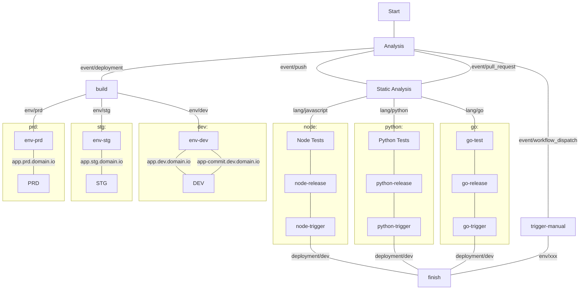

# Github Actions Fast Pipelines

[](https://github.com/semantic-release/semantic-release)

This is a personal work in progress. Keep in mind your suggestions are welcome! :)

These workflows are highly opinionated **kubectl-apply** or **helm-upgrade** pipelines.

       


## tldr;

1. Config tour repository with [these](#repository-secrets) secrets.
1. Create a directory `.github/workflow` in your repository and add [this](#pipeline) file.
1. Create a another directory `manifests` and add [this]() file.
1. Commit and open your repository actions page! :)


## Introduction

### Features

- Versioning with [Semantic-Release](https://semantic-release.gitbook.io/semantic-release/)
- Linter:
    - [Hadolint](https://github.com/marketplace/actions/hadolint-action) for Dockerfiles
    - ESLint for Javascript
    - PyLint for Python
- Static analysis: 
    - [GitLeaks](https://github.com/zricethezav/gitleaks) for repository
    - [Trivy](https://github.com/aquasecurity/trivy) for repository and image
    - Open Source Static Analysis Runner
    - GitHub's CodeQL analyzer
- Dynamic container generator

### Repository Patterns

This pipeline assumes you have just `4` types of repositories:

| Name | Short | Description | Result |
| ---: | :---: | --- | :---: |
| Web Application | app | Front-end application with internet-facing ingress | language-based pod |
| Mobile Application | mob | Mobile application | apk |
| Service | svc | Microservice that may - or may not - have ingress | nginx-based pod |
| Infrastructure as Code | iac | Code that generates cloud infrastructure | - |

Those repositories must obey a name pattern.

`{ecosystem}-{type}-{name/client/integration}`

Examples:

- `ff-svc-clients`: microservice that manages clients' data
- `ff-app-budget`: application that organizes the company finances
- `ff-mob-auth`: 2FA mobile application
- `ff-iac-aws`: infra as code to manage the aws environment

Checkout the test repositories:

| Type| Solution | Repository | Pipeline | Deploy |
| :---: | --- | :---: | :---: | :---: |
| app |    | [filipeforattini/ff-app-react](https://github.com/filipeforattini/ff-app-react) |  | [](https://ff-app-react.dev.forattini.app) |
| app |    | [filipeforattini/ff-app-vue](https://github.com/filipeforattini/ff-app-vue) |  | [](https://ff-app-vue.dev.forattini.app) |
| svc |    | [filipeforattini/ff-svc-express](https://github.com/filipeforattini/ff-svc-express) |  | [](https://ff-svc-express.dev.forattini.app) |
| svc |   | [filipeforattini/ff-svc-fastapi](https://github.com/filipeforattini/ff-svc-fastapi) |  | [](https://ff-svc-fastapi.dev.forattini.app) |
| svc |   | [filipeforattini/ff-svc-flask](https://github.com/filipeforattini/ff-svc-flask) |  | [](https://ff-svc-flask.dev.forattini.app) |
| svc |    | [filipeforattini/ff-svc-moleculer](https://github.com/filipeforattini/ff-svc-moleculer) |  | [](https://ff-svc-moleculer.dev.forattini.app) |
| svc |    | [filipeforattini/ff-svc-nestjs](https://github.com/filipeforattini/ff-svc-nestjs) |  | [](https://ff-svc-nestjs.dev.forattini.app) |
| svc |    | [filipeforattini/ff-svc-nextjs](https://github.com/filipeforattini/ff-svc-nextjs) |  | [](https://ff-svc-nextjs.dev.forattini.app) |

### Environments

| Name | Short | Description |
| ---: | :---: | --- |
| Development | dev | Env for you and your team to test and explore |
| Staging | stg | Stable env for code shipping |
| Sandbox | sbx | Production-like env for external developers |
| Production | prd | Where the magic happens |
| Disaster Recovery | dry | Production copy |

## Usage

### Flow



### Repository Structure

```
├─ .github
│  └─ workflows
│  │  └─ pipeline.yml
│  └─ dependabot.yml
├─ manifests
│  ├─ configs
│  │  └─ dev.env
│  ├─ dependencies
│  │  └─ dev.yml
│  ├─ secrets
│  │  └─ dev.gpg
│  ├─ k8s.yml
│  └─ helm.yml
├─ build
│  // distibuition version of our code
└─ src
   // our code goes here
```

### Repository Secrets


| Name | Description |
| ---: | --- |
| GPG_PASSPHRASE |  |
| KUBE_CONFIG | Your `~/.kube/config` file as base64. |
| PIPELINE_DEPLOY_TOKEN | A GitHub token, see the permissions below. |
| REGISTRY_USERNAME | Registry username. |
| REGISTRY_PASSWORD | Registry password. |


### Pipeline

Add this pipeline to your repository creating a file `pipeline.yml` in your `.github/workflows` directory.

#### For SVC
```yml
name: pipeline

on: 
  push:
  deployment:
  release:
    types: [created]
  pull_request:
    types: [opened, reopened]

  workflow_dispatch:
    inputs:
      environment:
        description: 'Environment'
        required: true
        type: choice
        default: 'dev'
        options:
        - dev
        - stg
        - prd

jobs:

  SVC:
    uses: filipeforattini/ff-iac-github-actions/.github/workflows/svc.yml@main
    secrets: inherit
    with:
      mainBranch: main
      containerRegistry: ghcr.io
      environmentsAsNamespaces: true
```

#### Parameters

| Name | Default | Description |
| --- | --- | --- |
| containerRegistry | ghcr.io | Container registry host that you will use |
| environmentsASnamespaces | false |  |


#### Deploy with kubetl apply

Create a file `k8s.yml` in your `manifests` directory.

```yml
#@data/values
---
port: 1234

env:
  - name: TZ
    value: America/Sao_Paulo

ingress:
  enable: true
  className: traefik

  tls:
    enable: true
    domain: your.domain
```

### Requirements

Configure your k8s cluster and get your `~/.kube/config`.

## Daily work

### Commits & Versioning

```bash
git commit -m "action(scope): subject"
```

Where the actions:
- `feat`: new feature for the user, not a new feature for the build script
- `fix`: bug fix for the user, not a fix for a build script
- `docs`: documentation changes
- `style`: formatting, lack of semicolons, etc; no changes to the production code
- `refactor`: refactoring the production code, for example. renaming a variable
- `test`: adding missing tests, refactoring tests; no changes to the production code
- `chore`:updating grunted tasks, etc; no changes to the production code

Adds `BREAKING CHANGE` in the commit message and it will generate a new **major** version.

### Secrets

```bash
gpg -v \
  --symmetric \
  --cipher-algo AES256 \
  --output ./manifests/secrets/dev.gpg \
  ./manifests/secrets/dev.env
```

Thanks to:
- https://evilmartians.com/chronicles/build-images-on-github-actions-with-docker-layer-caching
- https://github.blog/2022-05-09-supercharging-github-actions-with-job-summaries/
- https://blog.gitguardian.com/github-actions-security-cheat-sheet/

## Example ecosystem
This ecosystem generates few data per second as samples for our apis.


### Architecture

#### Full independent

In this implementation, each service has its own resources.


#### Shared resources

In this implementation, all services connects to a shared resource.


